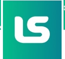

# Lacrei Saúde - Front-end Challenge


---
## Sobre o projeto

Este projeto foi desenvolvido como parte do desafio técnico de Front-end da **Lacrei Saúde**, com o objetivo de criar uma interface digital acessível, responsiva e acolhedora, considerando princípios de inclusão, diversidade e uma melhor experiência para diferentes pessoas usuárias.
A aplicação foi construída com foco em uma navegação simples e intuitiva, buscando proporcionar uma experiência mais humanizada para a comunidade LGBTQIA+ e demais pessoas que utilizam plataformas digitais de saúde.
Durante o desenvolvimento, foram aplicadas boas práticas de Front-end, incluindo componentização, organização de código, responsividade, acessibilidade e criação de componentes reutilizáveis. A estrutura do projeto foi pensada para facilitar a manutenção, escalabilidade e evolução contínua da aplicação.
  -A arquitetura permite futuras melhorias, como ampliação da cobertura de testes automatizados, otimizações de performance, aprimoramentos de acessibilidade e implementação de novas funcionalidades conforme as necessidades do produto.
---
## 🚀 Tecnologias utilizadas

- **Next.js** — Framework React utilizado para estruturação da aplicação, organização das páginas e otimização do carregamento.
- **React** — Biblioteca utilizada para construção da interface através de componentes reutilizáveis.
- **TypeScript** — Utilizado para tipagem estática, maior segurança no desenvolvimento e melhor manutenção do código.
- **Styled Components** — Utilizado para estilização dos componentes de forma modular e organizada.
- **Jest** — Framework utilizado para criação e execução dos testes automatizados.
- **Testing Library** — Biblioteca utilizada para validar os componentes considerando a interação da pessoa usuária.
- **Lucide React** — Biblioteca de ícones utilizada para complementar a interface de forma consistente e acessível.
---
## 📌 Funcionalidades

- Página inicial com apresentação da plataforma;
- Navegação responsiva para desktop, tablet e mobile;
- Página de ajuda com informações direcionadas aos usuários;
- Componentes reutilizáveis para facilitar manutenção e evolução do projeto;
- Menu de acessibilidade;
- Layout adaptável para diferentes resoluções;
- Footer com navegação e organização dos principais links;
- Testes automatizados dos componentes principais.

---

## ♿ Acessibilidade

Foram aplicadas práticas de acessibilidade com o objetivo de proporcionar uma experiência mais inclusiva:

- Utilização de elementos HTML semânticos;
- Labels e atributos ARIA quando necessários;
- Navegação acessível utilizando teclado;
- Foco visual em elementos interativos;
- Estrutura preparada para leitores de tela;
- Organização adequada da hierarquia de informações.

As validações de acessibilidade foram realizadas utilizando boas práticas de desenvolvimento e análise dos elementos da interface.

---

## 📱 Responsividade

A aplicação foi desenvolvida considerando diferentes dispositivos e tamanhos de tela:

- Desktop;
- Tablet;
- Mobile.

Foram utilizados layouts flexíveis e componentes adaptáveis para garantir uma experiência consistente em diferentes resoluções.

---

## 🔧 Como executar o projeto

Clone o repositório:

```bash
git clone https://github.com/ElzaDevs/lacrei-saude-frontend.git
---
---

## Reconhecimento

Este projeto foi desenvolvido como parte do **Desafio Técnico de Front-end da Lacrei Saúde**.

Agradeço à equipe da **Lacrei Saúde** pela oportunidade de participar deste desafio e pela iniciativa de desenvolver soluções digitais voltadas para inclusão, acessibilidade e acolhimento na área da saúde.

<div align="center">



<br>

**Lacrei Saúde**

Tecnologia e saúde conectadas para ampliar o acesso ao cuidado.

<br>

<a href="https://www.linkedin.com/company/lacrei-saude/" target="_blank">
LinkedIn oficial da Lacrei Saúde
</a>

</div>

---


